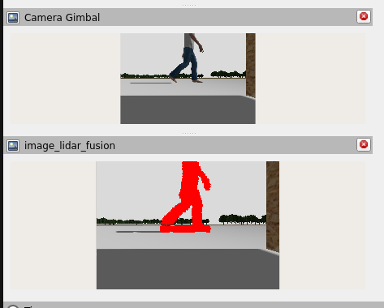
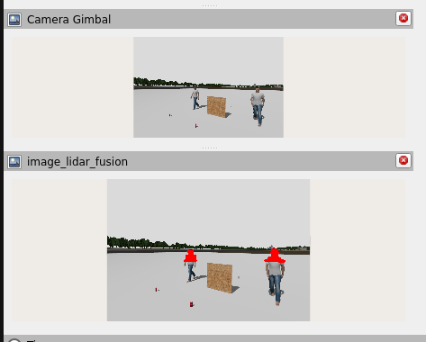
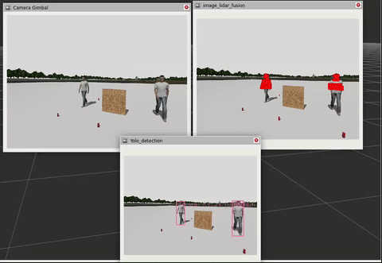
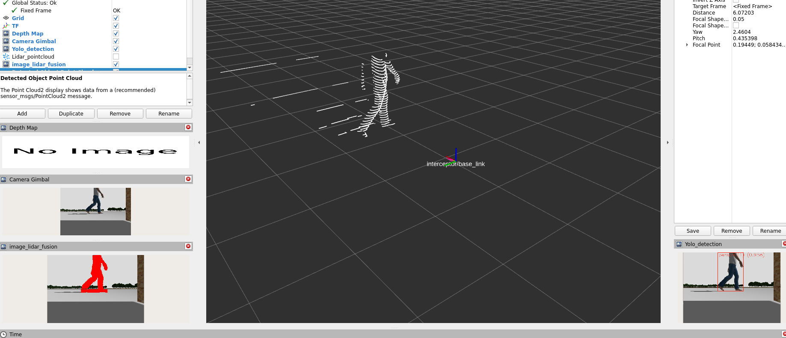

# 🤖 ROS2 Camera-Lidar Fusion Package

## 📝 Description

This ROS2 package implements sensor fusion between 360-degree lidar and camera data, combining object detection with point cloud processing for precise 3D object localization. The system performs real-time transformation of lidar point clouds into the camera frame and associates point cloud clusters with detected objects, enabling accurate position estimation through point cloud centroid calculation.

## ✨ Core Features

- Real-time sensor fusion between lidar and camera data
- YOLOv11-based object detection integration
- Point cloud filtering and transformation using PCL
- Dynamic coordinate frame transformation using tf2
- Multi-object tracking and 3D position estimation
- Visualization of fused sensor data
- Configurable depth range and frame parameters

## 🎥 Demonstration

### 📸 Lidar-Camera Fusion Visualization

<p align="center">
Overlaying Detected Object Point Cloud Points onto Camera Image:
</p>

<p align="center">
  
  
  
</p>

<p align="center">
Publishing Points Within Detected Object Bounding Boxes:
</p>

<p align="center">
  
  
</p>

## 🔧 Technical Implementation

### Node Architecture
- **Name**: `lidar_camera_fusion_node`
- **Language**: C++17
- **ROS2 Version**: Humble

### Dependencies
- ROS2 Humble
- Point Cloud Library (PCL)
- OpenCV
- YOLOv8 ROS
- tf2
- message_filters
- geometry_msgs
- sensor_msgs

### Topics

#### Subscribed Topics
- `/scan/points` ([sensor_msgs/msg/PointCloud2]) - Raw lidar point cloud data
- `/interceptor/gimbal_camera` ([sensor_msgs/msg/Image]) - Camera image feed
- `/interceptor/gimbal_camera_info` ([sensor_msgs/msg/CameraInfo]) - Camera calibration info
- `/rgb/tracking` ([yolov8_msgs/msg/DetectionArray]) - Object detection results

#### Published Topics
- `/image_lidar_fusion` ([sensor_msgs/msg/Image]) - Visualization with projected points
- `/detected_object_pose` ([geometry_msgs/msg/PoseArray]) - 3D poses of detected objects
- `/detected_object_point_cloud` ([sensor_msgs/msg/PointCloud2]) - Object point clouds

### Parameters
- `lidar_frame` (string, default: "x500_mono_1/lidar_link/gpu_lidar") - Lidar frame ID
- `camera_frame` (string, default: "interceptor/gimbal_camera") - Camera frame ID
- `min_depth` (float, default: 0.2) - Minimum point cloud depth
- `max_depth` (float, default: 10.0) - Maximum point cloud depth

## 🛠️ Installation

### 📋 Prerequisites
Before using the package, you need the below requirements:

- **🤖 ROS2 Humble** ([Installation Guide](https://docs.ros.org/en/humble/Installation.html))
- **🕵️ YOLOvX ROS** ([Setup Instructions](https://github.com/mgonzs13/yolov8_ros))
- **💻 C++ Compiler**: GCC 8 or newer
- **📚 Required Libraries**: PCL, OpenCV, and standard ROS2 dependencies


### Clone and Build Instructions
```bash
# Clone the repository
cd ~/ros2_ws/src
git clone https://github.com/YourUsername/ros2_lidar_camera_fusion.git

# Build the package
cd ~/ros2_ws
colcon build --packages-select ros2_lidar_camera_fusion
source install/setup.bash
```

## 🚀 Usage

### Launch Files
The package provides a primary launch file for running the fusion node with YOLOv11:

```bash
ros2 launch ros2_lidar_camera_fusion lidar_camera_fusion_yolo.launch.py
```

### Configuration
Modify the launch file parameters in `launch/lidar_camera_fusion_yolo.launch.py.yaml`:
  
  1- `min_depth`
  

```yaml
parameters=[
            {'min_depth': 0.2, 'max_depth': 10.0, # Setup your min and max depth range, where (x-axis) is the depth
             'lidar_frame': 'x500_mono_1/lidar_link/gpu_lidar',
             'camera_frame': 'interceptor/gimbal_camera'}  # Default target frame
```

### Transform Configuration
Ensure proper tf2 configuration between your lidar and camera frames. Example static transform:

```bash
ros2 run tf2_ros static_transform_publisher 0 0 0 0 0 0 base_link camera_frame
```

## 🔍 Implementation Details

### Point Cloud Processing
- Filters point cloud data using PCL's CropBox filter
- Transforms points from lidar to camera frame using tf2
- Projects 3D points onto the camera image plane

### Object Detection Integration
- Synchronizes point cloud, image, and detection data using message_filters
- Associates point cloud clusters with detected object bounding boxes
- Calculates object centroids for position estimation

### Visualization
- Projects lidar points onto camera image
- Visualizes detected objects with bounding boxes
- Displays associated point cloud clusters

## 🤝 Contributing

1. Fork the repository
2. Create your feature branch (`git checkout -b feature/AmazingFeature`)
3. Commit your changes (`git commit -m 'Add some AmazingFeature'`)
4. Push to the branch (`git push origin feature/AmazingFeature`)
5. Open a Pull Request

## 📝 License

This project is licensed under the MIT License - see the LICENSE file for details.